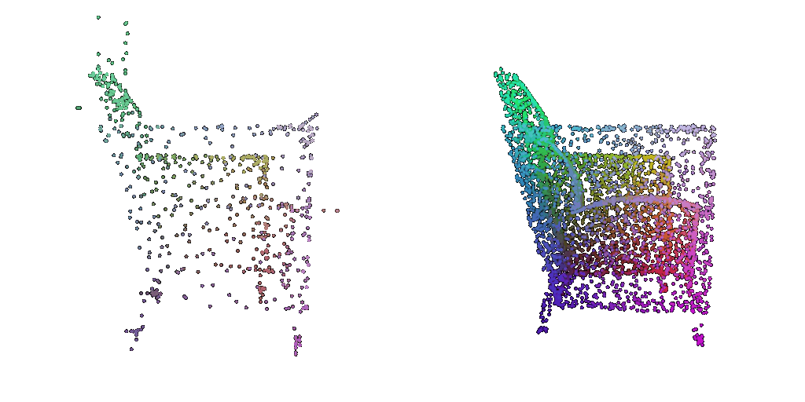
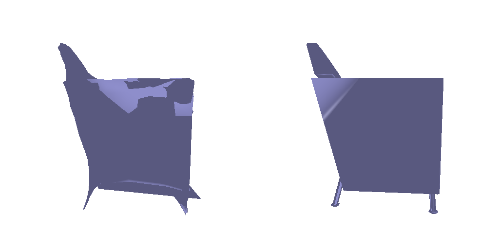

# Single View to 3D README

## Configuration

Update the `data_location.py` file with the root location of your dataset to match your system's directory structure.

## Execution Instructions

Execute the following commands in your terminal. If necessary, replace `python` with the version specific to your system (e.g., `python3`).

### Exploring Loss Functions

#### Voxel Representation
```
python fit_data.py --type 'vox'
```


#### Point Representation

```
python fit_data.py --type 'point'
```

#### Mesh Representation

```
python fit_data.py --type 'mesh'
```



