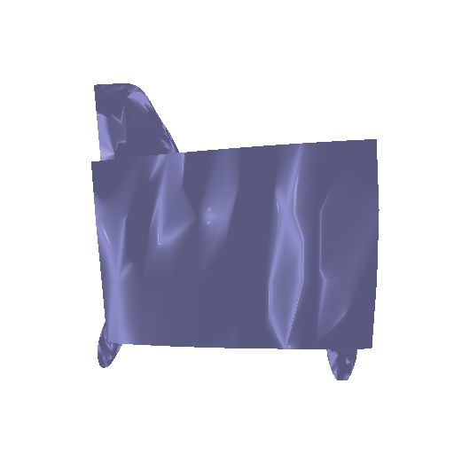

# Single View to 3D README

## Configuration

Update the `data_location.py` file with the root location of your dataset to match your system's directory structure.

## Execution Instructions

Execute the following commands in your terminal. If necessary, replace `python` with the version specific to your system (e.g., `python3`).

### Exploring Loss Functions

#### 1.1 Voxel Representation
```
python fit_data.py --type 'vox'
```


#### 1.2 Point Representation

```
python fit_data.py --type 'point'
```


#### 1.3 Mesh Representation

```
python fit_data.py --type 'mesh'
```


### 2. Reconstructing 3D from a Single View

For training the model and reconstructing 3D from a single view, use the following commands:

#### 2.1 Voxel-Based Model

- This will create "checkpoint_vox.pth" in the root directory.
```
python train_model.py --type 'vox'
```
- Evaluate the model with:

```
python eval_model.py --type 'vox' --load_checkpoint
```

- Change the `step` parameter to select specific predictions to save.
- Predictions and ground truths will be saved in "Visualization/Vis_vox".

<!-- <head>
    <style>
        .image-container .image img {
            width: 300px;
            height: 300px;
            object-fit: cover;
        }
    </style>
</head>
<div class="image-container">
    <div class="image">
        
        <p>Input RGB Image</p>
    </div>
    <div class="image">
        
        <p>Ground Truth</p>
    </div>
    <div class="image">
        
        <p>Predicted</p>
    </div>
</div> -->
<!-- 
   -->
<meta charset="utf-8" emacsmode="-*- markdown -*">
<div style="display: flex; justify-content: space-between;">
    <div style="margin-right: 10px;">
        
        <p style="text-align: center;">Input RGB Image</p>
    </div>
    <div style="margin-right: 10px;">
        
        <p style="text-align: center;">Ground Truth</p>
    </div>
    <div>
        
        <p style="text-align: center;">Predicted</p>
    </div>
</div>

<style>
    .image-container {
        display: flex; 
        justify-content: space-between; 
    }

    .image {
        text-align: center;
    }
</style>

#### 2.2 Point-Based Model

- This will create "checkpoint_point.pth" in the root directory.
```
python train_model.py --type 'point'
```
- Evaluate the model with:

```
python eval_model.py --type 'point' --load_checkpoint
```
- Predictions and ground truths will be saved in "Visualization/Vis_point".

#### 2.3 Mesh-Based Model

- This will create "checkpoint_mesh.pth" in the root directory.
```
python train_model.py --type 'mesh'
```
- Evaluate the model with:

```
python eval_model.py --type 'mesh' --load_checkpoint
```
- Predictions and ground truths will be saved in "Visualization/Vis_mesh".

After each evaluation, the threshold vs F1 score plot is saved in the "Visualization/Evaluation" directory.
